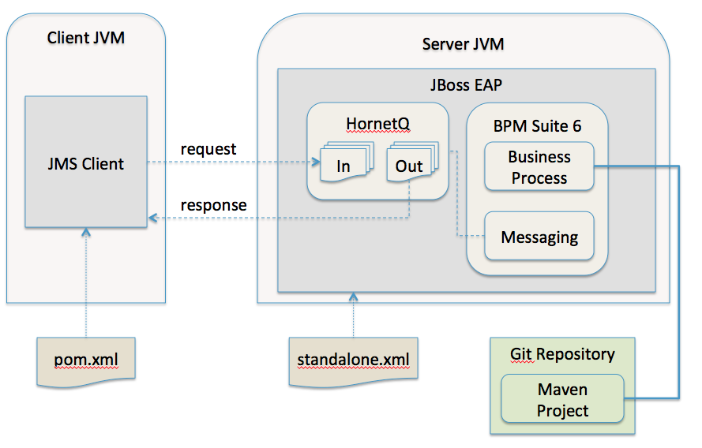

:data-uri:
:toc2:
:labs: link:http://people.redhat.com/althomas/eap6/eap6CourseMaterial.html[Course Materials]

image::images/rhheader.png[width=900]

:numbered!:
[abstract]
== JMS to BPM Suite 6 Process Engine
This reference architecture provides a detailed example of how to configure and use the JMS interface to the BPM Suite 6 process engine.
Along with the explanation, a project is provided with instructions on how to execute the example.

:numbered:

== The Use Case
Message queues are a vital component to many application architectures.  Any time two independent systems are required to communicate, there is the high potential
that they will differ in processing speed and availbility.  This leads to the need for asynchronous communication to decouple the sender from the receiver.  This decoupling
has numerous benefits to the overall system including:

. *Decoupling* - The two systems can be extended and modified independently as long as they adhere to the same interface requirements
. *Redundancy* - The message may be held safely in the queue until the receiver is able to process the message without errors.
. *Scalability* - 
. *Resiliency* -
. *Delivery Guarantees* - 
. *Ordering Guarantees* - 
. *Buffering* - 

== BPM Suite 6 integration via JMS
The following architecture diagram illustrates the components discussed below.

.JMS to BPM Suite 6 Architecture Diagram

== Performance Testing
In the following we measure the system impact when changes are made to configuration paramenters on the JMS interface between BPM Suite 6 and 
JMS client applications.  Other relevant BPM Suite 6 configuration options are also taken into consideration.
* Queue sizeing
* message listener configuration
* durable vs non-durable queues
* Single process knowledge session vs process per request

.Tiger block image
image::images/tiger.png[Tiger image]
